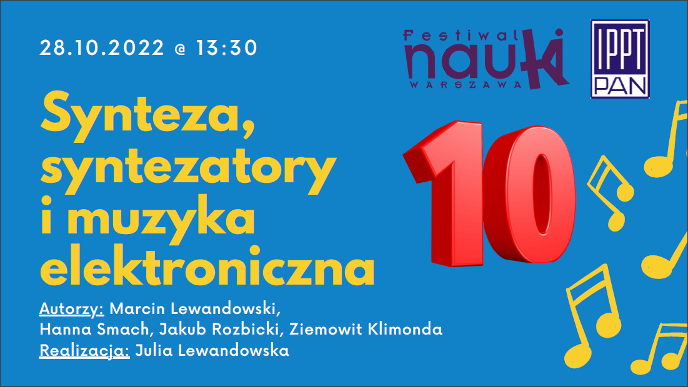

# Lab4US: Festiwal Nauki 2022

## Synteza, syntezatory i muzyka elektroniczna
<i><u>AUTORZY</u>: Marcin Lewandowski (prezenter), Hanna Smach, Jakub Rozbicki, Ziemowit Klimonda.
 
<u>REALIZACJA</u>: Julia Lewandowska.</i>

<!--- [Prezentacja w IPPT PAN (28.09.2022)](figs/photo-1.jpg)] --->

### OPIS
Synteza dźwięków fascynowała ludzi od dawna. Pierwsze syntezatory elektroniczne powstały w latach 1950, a wielki boom na ich wykorzystanie w muzyce nastąpił na przełomie lat 1970/1980. Dzisiaj syntezatory są nieodłącznym elementem niemal każdego gatunku muzycznego. 

Chcemy pokazać na czym polega synteza dźwięku i jak zbudowane są syntezatory analogowe i cyfrowe. Do dzisiaj dźwiękowcy i artyści wykorzystują ogromne syntezatory modularne do tworzenia unikalnych dźwięków, które znamy z filmów.
Interesujące będzie także usłyszeć w jaki sposób z prostych przebiegów elektrycznych tworzy się dźwięki, akordy, a potem melodię. Pokażemy odwrotność syntezy – czyli analizę spektralną. 

Na Wielki Finał szykujemy coś specjalnego … lasery, które posłużą do pokazania obrazów rysowanych muzyką!
Wszyscy poczują klimat dyskoteki szkolnej z lat 80 – dlatego zapraszamy do przyjścia w modnym obecnie retro z tamtych lat!

### MATERIAŁY

|  |
|:--:|
| [Video na YouTube](https://www.youtube.com/watch?v=1YFF4WXSf8I). |

|  |
|:--:|
| [Slajdy w PDF](2022-Festiwal-Music_Synth.pdf). |

<u>Pliki konfiguracyjne (tzw. patch) do oprogramowania [VCV Rack 2](https://vcvrack.com/Rack)</u>:

- [vco.vcv](vcv/vco.vcv) - elementrany Syntezator z 1x VCO + VCA/ADSR + VCF.
- [lissajous.vcv](vcv/lissajous.vcv) - prosty generator krzywych Lissajous.
- [lissajous-art.vcv](vcv/lissajous-art.vcv) - generator krzywych Lissajous z wykorzystaniem oscylatora wavetable oscillator XFX Wave.

### LINKI
- [DŹWIĘK MUZYCZNY - Właściwości, analiza i resynteza addytywna](https://sound.eti.pg.gda.pl/student/eim/02-DzwiekMuzyczny.pdf)
- [GOOGLE Music, Makers, Machines](https://artsandculture.google.com/project/music-makers-and-machines)
- Youtube:
    - [Oscilloscope Music](https://www.youtube.com/c/jerobeamfenderson1)
    - [Cabotage KSM VCV Tutorials](https://www.youtube.com/playlist?list=PLCsHEamPSpEzLB-qONN3VkfwLvApAVVBE)
- Software:
    - [VCV Rack 2](https://vcvrack.com/Rack)
    - [Patche do VCV Rack 2](https://patchstorage.com/platform/vcv-rack/)